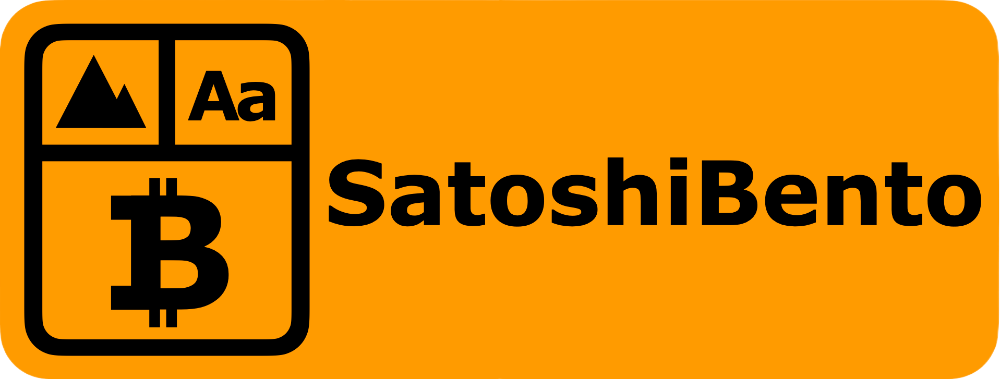
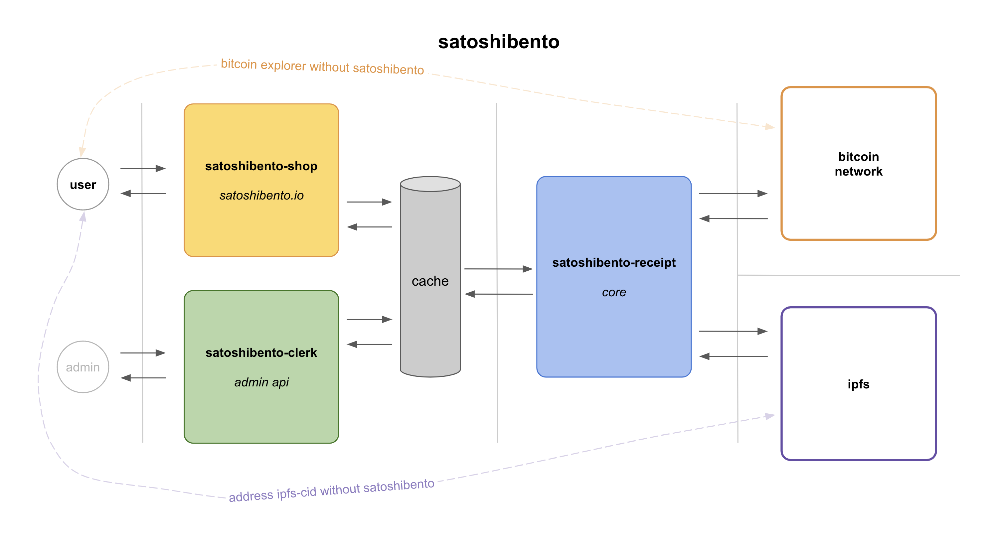

> SatoshiBento is a service that utilizes the bitcoin network.

> SatoshiBento makes it easy for you to engrave a message on the bitcoin-network.

> SatoshiBento helps you store and certificate your file permanently with the digest on the bitcoin-network and the original on the IPFS.
    
## Design

## SatoshiBento-Shop
- https://satoshibento.io
- Public / vue
- Repository : https://github.com/ideajoo/satoshibento-shop

## SatoshiBento-Clerk
- admin-api
- Private / node.js
- Repository : https://github.com/ideajoo/satoshibento-clerk

## SatoshiBento-Receipt
- core
- Private / golang
- Repository : https://github.com/ideajoo/satoshibento-receipt
- Dependency : https://github.com/ideajoo/go-bitcoin-opreturn
- Dependency : https://github.com/ideajoo/go-bitcoin-cli-light

## Document
- Document is being prepared 

## Contact 
- Email : nerd@satoshibento.io