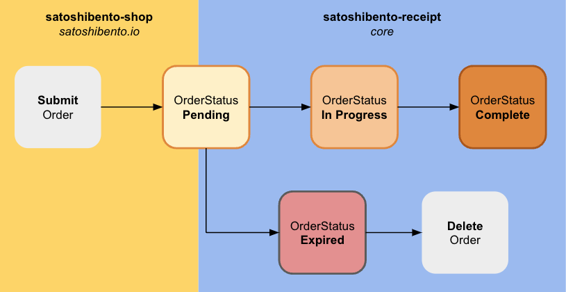
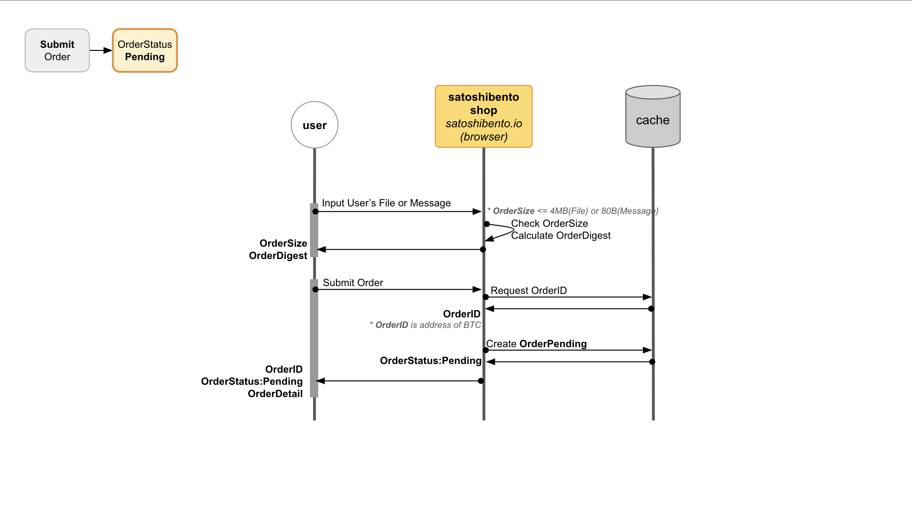

> SatoshiBento is a service that utilizes the bitcoin network.

> SatoshiBento makes it easy for you to engrave a message on the bitcoin-network.

> SatoshiBento helps you store and certificate your file permanently with the digest on the bitcoin-network and the original on the IPFS.
> SatoshiBento is not NFT. SatoshiBento is not token. But SatoshiBento has key functions of concept of the NFT.

> SatoshiBento give PDF of order-receipt to you. 

> Without SatoshiBento, Your order can be checked on the bitcoin network, such as your message or file-integrity.

> Without SatoshiBento, Your order-receipt-PDF or order-file can be download on ipfs.

    
# SatoshiBento Design

# SatoshiBento OrderCycle

## SatoshiBento SubmitOrder -> OrderStatus:Pending

## SatoshiBento OrderStatus:Pending -> OrderStatus:InProgress

## SatoshiBento OrderStatus:InProgress -> OrderStatus:Complete

## SatoshiBento OrderStatus:Pending -> OrderStatus:Expired

# SatoshiBento-Shop
- https://satoshibento.io
- vue
- Repository(Public) : https://github.com/ideajoo/satoshibento-shop

# SatoshiBento-Receipt
- core
- golang
- Repository(Private) : https://github.com/ideajoo/satoshibento-receipt
- Dependency(Public) : https://github.com/ideajoo/go-bitcoin-opreturn
- Dependency(Public) : https://github.com/ideajoo/go-bitcoin-cli-light

# SatoshiBento-Clerk
- admin-api
- node.js
- Repository(Private) : https://github.com/ideajoo/satoshibento-clerk

# Document
- Document is being prepared 

# Contact 
- Email : nerd@satoshibento.io